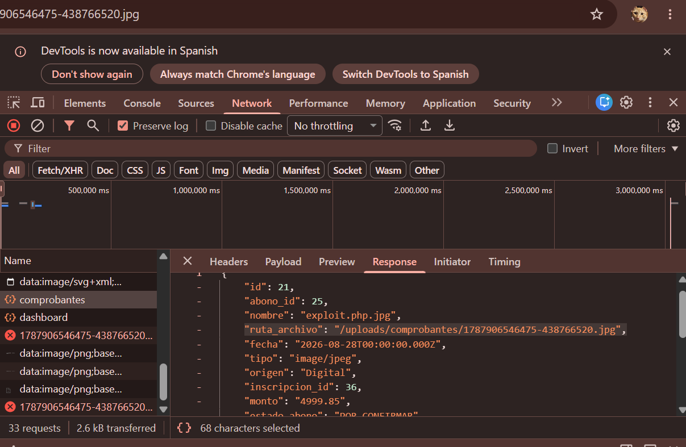
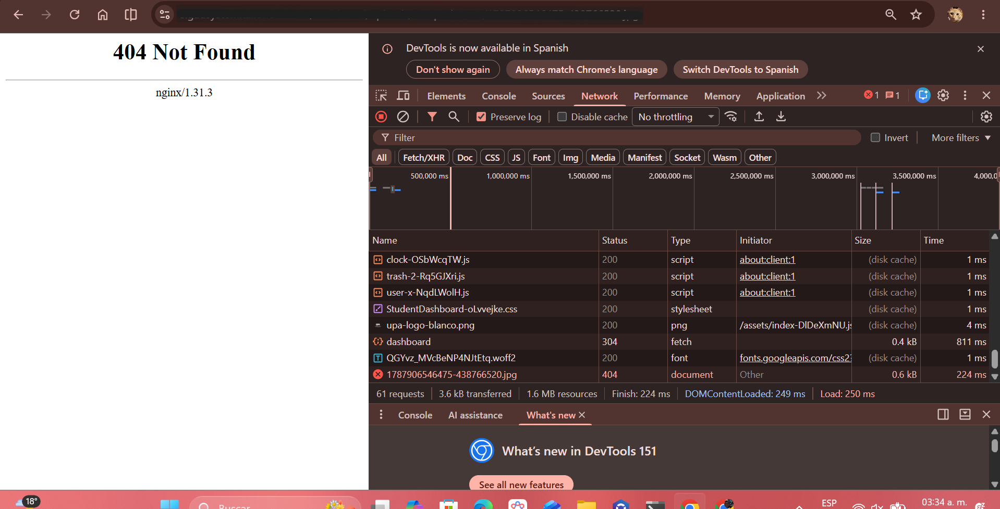
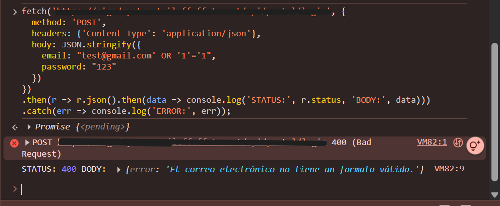
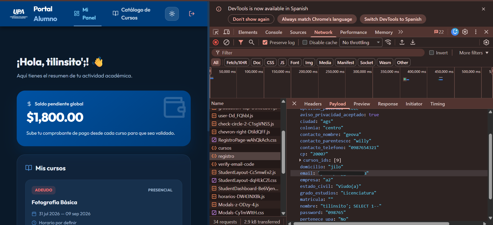
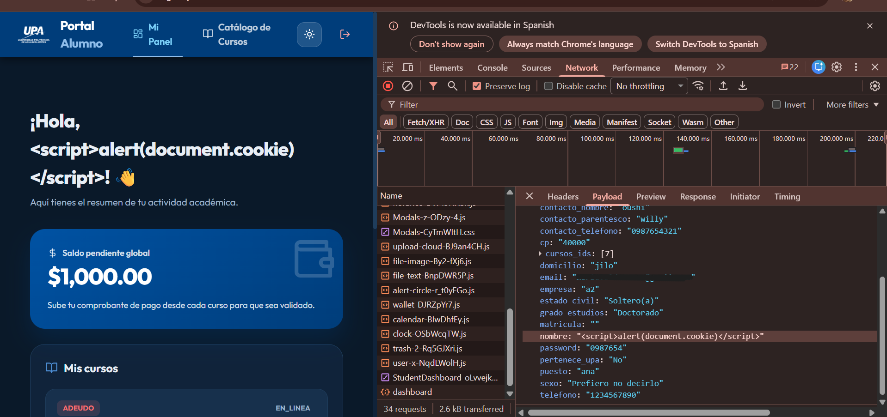

# Web Application Security Assessment

**Type:** Academic penetration testing case study
**Environment:** Isolated lab web application (no real user data)
**Methodology reference:** OWASP Testing Guide / PTES (Penetration Testing Execution Standard)
**Status:** All tested vectors assessed and closed (mitigated or blocked).

---

## Executive Summary

This report documents a controlled security assessment of a web application deployed in an academic lab environment. Three attack vectors were evaluated: **arbitrary file upload**, **SQL Injection**, and **Stored Cross-Site Scripting (XSS)**.

The file upload vector was tested end-to-end: the server successfully neutralized the attempted attack by renaming uploaded files and stripping executable extensions, preventing remote code execution. The SQL Injection vector was tested against two distinct fields: the login endpoint's email field rejected the payload through format validation before it reached the database layer, while the registration endpoint's name field accepted the payload but stored it as inert literal text — no query error, no unexpected execution — indicating the use of parameterized queries. Following up on the observation that the registration endpoint accepts unrestricted special characters, a Stored XSS vector was also tested on the same field; the frontend properly escaped the injected script, and no code execution occurred.

Overall, the application demonstrates multiple layers of effective input-handling controls across different endpoints, validation strategies, and rendering contexts.

### Findings Summary

| ID | Vulnerability / Vector | Target Endpoint | Current Risk | Status |
|---|---|---|---|---|
| SEC-01 | Remote Code Execution via File Upload | `/dashboard/uploads/comprobantes/` | Informational (Mitigated) | Closed |
| SEC-02 | SQL Injection — Auth Bypass Attempt | `/api/portal/login` | Informational (Blocked) | Closed |
| SEC-03 | SQL Injection — Input Parameterization Check | `/api/portal/register` | Informational (Parameterized) | Closed |
| SEC-04 | Stored XSS Attempt | `/api/portal/register` (`nombre` field) | Informational (Escaped) | Closed |

---

## 1. Scope & Rules of Engagement

- **Authorized environment:** Web application deployed by a fellow student's team as part of an academic project (9th-semester coursework). No real user data is stored in the system.
- **Authorization:** Verbal and written permission obtained from the team member responsible for the system, confirming it was a test deployment intended for security evaluation.
- **Target (anonymized):** `target-system.internal` — a `.ts.net` (Tailscale) hosted test instance.
- **Objective:** Evaluate the security of the authentication module, the registration module, and the receipt/document upload endpoint (`/dashboard/uploads/comprobantes/`).
- **Out of scope:** Any production system, any system outside the explicitly authorized test deployment, denial-of-service testing.

---

## 2. Reconnaissance

**Passive:**
- Reviewed exposed front-end source code and application structure via browser DevTools.
- Identified client-side JavaScript bundles and endpoint naming conventions (`/api/portal/login`, `/api/portal/register`, `/dashboard/uploads/comprobantes/`).

**Active:**
- Inspected HTTP requests and responses using Chrome DevTools (Network tab).
- Sent manual `fetch()` requests from the browser console to test endpoint behavior directly.

---

## 3. Scanning & Enumeration

- **Server identified:** `nginx/1.31.3` (via response headers). *Note: this version string does not correspond to a publicly known official Nginx release as of 2026 (current mainline is in the 1.27.x range). This may indicate a non-standard/spoofed version banner, a custom build, or a forked distribution (e.g., OpenResty). Flagged for informational purposes; not independently verified.*
- **Response mapping:** Analyzed JSON response structures from the backend, identifying fields such as `ruta_archivo`, `tipo`, `monto`, `nombre`, `matricula`, and others exposed in registration/upload responses.
- **Resource enumeration:** Attempted direct access to stored file paths to determine whether uploaded files were reachable and how they were renamed.

---

## 4. Vulnerability Analysis & Exploitation Attempts

### 4.1 File Upload — Remote Code Execution Attempt

**Technique:** Uploaded a file using a double extension (`exploit.php.jpg`), created by concatenating a valid JPEG image with a basic PHP web shell payload (`system($_GET['cmd'])`), attempting to get the server to interpret it as an executable PHP script.

**Intent:** If successful, this would allow remote command execution through a URL parameter (e.g., `?cmd=whoami`).

**Server behavior (defense observed):**
The backend accepted the upload but renamed the file and enforced a `.jpg` extension on the stored object (e.g., `/uploads/comprobantes/1787906546475-438766520.jpg`).

**Result:** The vulnerability was neutralized. Because the final stored file has a `.jpg` extension, the web server (Nginx) treats it as a static resource and does not invoke the PHP interpreter — the file is served as raw bytes/image data, not executed as code.

**Verification attempts:**
- Appending `?cmd=whoami` to the stored file's URL had no effect — GET parameters are ignored when no interpreter processes the file.
- Base64-decoding the stored file client-side only revealed the raw uploaded bytes; it did not trigger any server-side evaluation.




### 4.2 SQL Injection — Authentication Endpoint

**Technique:** Submitted a classic authentication bypass payload through the login form.

**Payload:**
```json
{
  "email": "test@gmail.com' OR '1'='1",
  "password": "123"
}
```

**Result:** `400 Bad Request` — `"El correo electrónico no tiene un formato válido."`

**Analysis:** The application performs server-side format validation on the email field (likely a regex-based check) before any data reaches the query layer. The malformed payload is rejected at the input-validation stage, never reaching the database layer. This is an effective mitigation for this specific field and vector.

**Note on defense-in-depth:** Format validation alone is not equivalent to true injection protection — an attacker could craft a payload that satisfies the expected email pattern while still attempting injection (e.g., `injection@test.com'--`). This field's real security therefore also depends on the query layer behavior confirmed in 4.3, not on format validation alone.



### 4.3 SQL Injection — Registration Endpoint

**Technique:** Submitted a payload targeting the `nombre` (name) field, which — unlike the login endpoint's email field — does not enforce strict client-side format validation (confirmed via DevTools inspection: the input element has no `pattern`, `maxlength`, or format restriction attributes).

**Payload:**
```json
{
  "nombre": "tilinsito'; SELECT 1--",
  "apellido_paterno": "cole",
  "apellido_materno": "tiline",
  "email": "[redacted-test-account]",
  "password": "[redacted]",
  "estado_civil": "Viudo(a)",
  "grado_estudios": "Licenciatura",
  "...": "..."
}
```

**Result:** Registration succeeded (`200`/`201`). The account was created successfully, and the payload was stored and rendered **as literal text** — visible unmodified in the post-login dashboard greeting (`¡Hola, tilinsito'; !`) and in the account's profile data.

**Analysis:** No SQL syntax error was triggered, no unexpected query executed, and the application did not crash or behave unexpectedly. This strongly suggests the backend uses **parameterized queries or an ORM** for the registration `INSERT` operation, treating user input strictly as data rather than executable SQL. This is an effective mitigation against classic string-concatenation-based SQL Injection on this field.

**Important caveat:** While the ORM correctly parameterized this input against SQL execution, the complete absence of server-side input sanitization on this field (no rejection of special characters like `'`, `;`) means the raw payload was stored and echoed back unmodified. This does not create a SQL Injection risk (confirmed above), but it does raise the question of whether the *same* unsanitized value could be exploited in a different context — specifically, when rendered back in the UI. This was tested directly in section 4.4.



### 4.4 Stored Cross-Site Scripting (XSS) — Registration Endpoint

**Technique:** Following the observation in 4.3 that the `nombre` field accepts and stores special characters without server-side sanitization, a Stored XSS payload was submitted through the same field to determine whether the value is safely escaped when rendered back in the UI (e.g., the dashboard greeting).

**Payload:**
```json
{
  "nombre": "<script>alert(document.cookie)</script>",
  "...": "..."
}
```

**Result:** Registration succeeded. Upon login, the dashboard greeting displayed the payload **as literal, visibly escaped text**:
```
¡Hola, <script>alert(document.cookie)</script>! 👋
```
No JavaScript execution occurred — no alert dialog appeared, and no script ran in the browser context.

**Analysis:** The frontend correctly escapes user-supplied data before rendering it in the DOM. This is consistent with the default auto-escaping behavior of modern frontend frameworks (e.g., React), which convert special characters into safe text representations unless a developer explicitly opts out (e.g., via `dangerouslySetInnerHTML` in React). This is an effective mitigation against Stored XSS in this specific field and rendering context.

**Scope note:** This test covered one field (`nombre`) rendered in one context (dashboard greeting). Other fields or rendering contexts (e.g., HTML attributes, URLs built from user input) were not tested and could theoretically behave differently; a full assessment would need to test each independently.



---

## 5. Impact Assessment (Theoretical)

Had the file upload vector succeeded, an attacker could have achieved remote code execution with the privileges of the web server process, potentially leading to full system compromise, data exfiltration, or lateral movement within the hosting environment. Had the Stored XSS vector succeeded, an attacker could have hijacked victim sessions (via cookie theft), performed actions on behalf of other users, or defaced application content for any user viewing the affected data. Both observed mitigations (extension stripping, output escaping) are effective controls against these specific techniques, though they should be paired with the additional defenses listed below for defense-in-depth.

---

## 6. Recommendations

1. **Rename all uploaded files using generated identifiers (e.g., UUIDs)** and enforce output extensions from an explicit allow-list — never trust the client-provided filename or extension.
2. **Validate file content by magic bytes on the backend**, not just MIME type or extension, to prevent attackers from bypassing controls by spoofing HTTP headers.
3. **Implement restrictive input validation (allow-listing)** so that fields like names reject unnecessary special characters (such as `<`, `>`, `'`, `"`) at the API layer — even though the ORM correctly parameterizes this input today, rejecting unnecessary special characters at the boundary reduces reliance on any single downstream control and mitigates secondary vectors like Stored XSS.
4. **Maintain context-aware output encoding** for any user-supplied data rendered back in the UI (e.g., the dashboard greeting) — current behavior is correct; ensure this remains consistent if new rendering surfaces (e.g., raw HTML rendering, email templates, PDF generation) are added in the future, since those contexts often bypass framework auto-escaping.
5. **Maintain parameterized queries / ORM usage across all database write operations** — the registration endpoint's resistance to SQL Injection despite accepting unrestricted input confirms this is already in place; ensure it remains consistent as new endpoints are added.
6. **Do not rely on client-side or format validation as a security control** — the login endpoint's email format check is a good UX feature, but format validation alone can often be bypassed by crafting a payload that satisfies the expected pattern. Parameterized queries, as already used on the registration endpoint, should be the primary defense — format checks are a secondary/UX layer, not a security boundary.
7. **Disable server banner exposure**: configure Nginx (`server_tokens off;`) to hide specific version numbers from HTTP response headers, reducing information disclosure that could otherwise aid an attacker in identifying known service CVEs — this is a good practice regardless of whether the observed version string is accurate or spoofed.
8. **Serve uploaded files through a controlled, authenticated endpoint** rather than direct static file paths, to reduce the attack surface for enumeration.

---

## 7. Lessons Learned

This was my first hands-on, semi-independent security assessment outside of a guided lab (DVNA). Key takeaways:

- Understanding *why* a mitigation works (extension stripping preventing PHP interpretation, parameterized queries neutralizing injection payloads, output escaping preventing script execution) is more valuable than just knowing an attack "didn't work."
- **Not all defenses are equal, and they operate at different layers.** Comparing the login and registration endpoints taught me that format validation (login) and parameterized queries (registration) protect against different things — format validation can be bypassed with a cleverly shaped payload, while parameterization neutralizes injection regardless of input shape.
- **One finding can point to the next.** Noticing that the registration endpoint accepted unsanitized special characters (from the SQLi test) raised the right follow-up question: "could this same gap be exploited in a different context?" — which led directly to testing Stored XSS on the same field. Good pentesting is as much about following up on unanswered questions as it is about the initial test.
- A field being "less restricted" at one layer (e.g., no client-side validation) doesn't automatically mean it's vulnerable — it depends on what protections exist at the layers that actually matter (server-side validation, query parameterization, output encoding).
- Documentation discipline (capturing evidence *as you test*, not after) is a skill in itself — I'm still improving at capturing evidence in the moment rather than reconstructing it afterward.
- Testing one variable at a time (one field, one endpoint, one vector) produces much clearer, more defensible findings than changing multiple things at once.

---

## Disclaimer

This assessment was conducted with explicit authorization from the system's responsible party, against a non-production, academic test environment containing no real user data. This repository is for educational and portfolio purposes only.